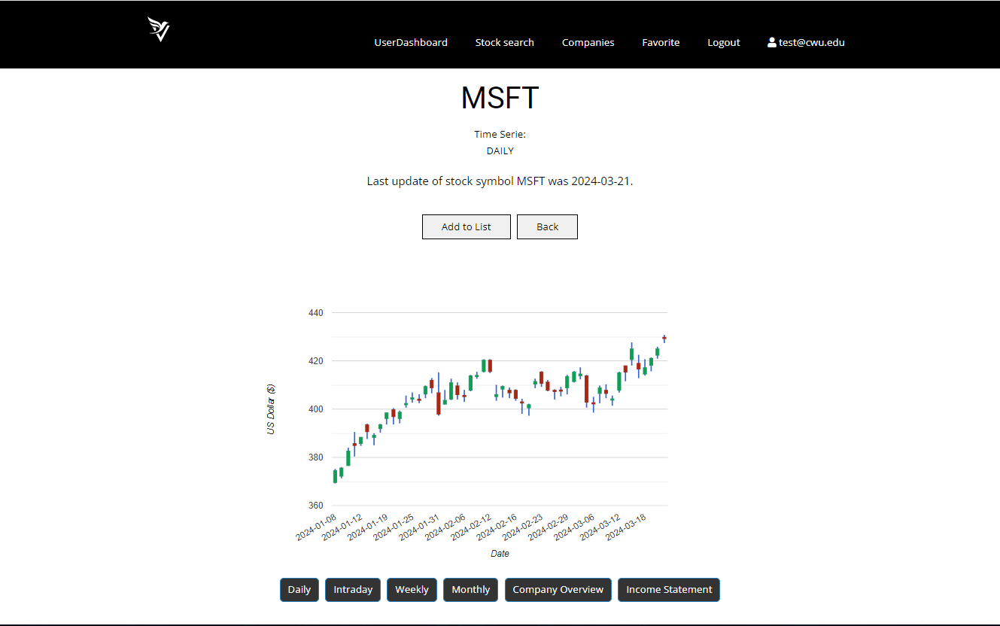

# VinStock

VinStock is a financial service application that provides users with access to comprehensive financial data for a set of U.S. listed stocks. The application includes historical share prices, financials, and company information for the listed stocks, enhancing users' ability to make informed investment decisions.

## Screenshots

*Figure 1: Homepage showcasing featured stocks*

*Figure 2: Detailed view of a stock including historical data and financials*

## Features

- Access to historical share prices for U.S. listed stocks.
- Detailed financial information including balance sheets, income statements, and cash flow statements.
- Company profiles and key metrics for each listed stock.
- User-friendly interface with intuitive navigation and multiple views for summary and detailed data.

## Getting Started

To get started with VinStock, follow these steps:

1. Clone the repository to your local machine:
